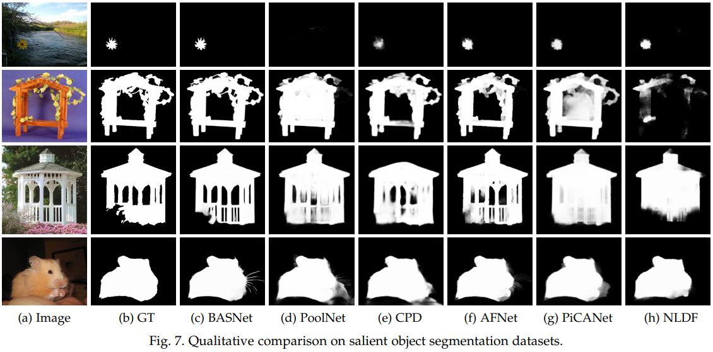
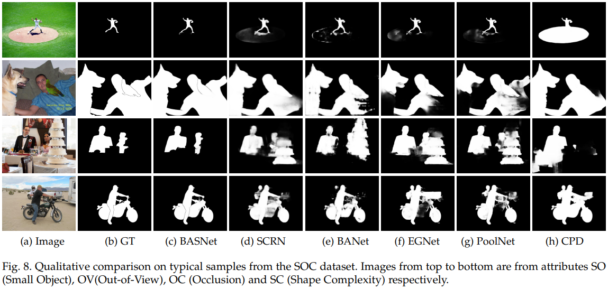
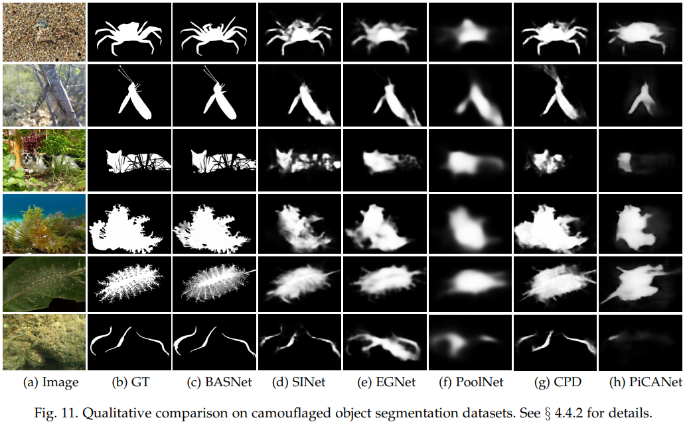
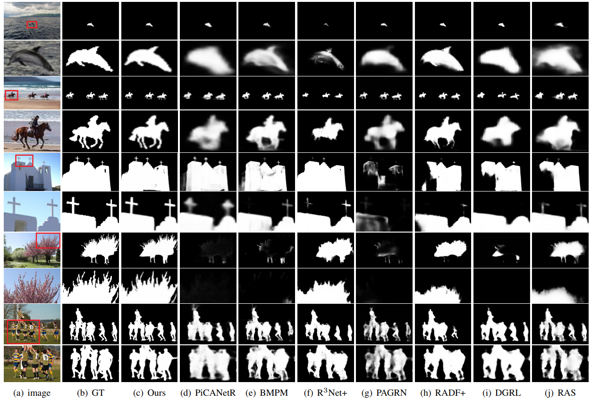

# BASNet (New Version May 2nd, 2021)

'[Boundary-Aware Segmentation Network for
Mobile and Web Applications](https://arxiv.org/pdf/2101.04704.pdf)', Xuebin Qin, Deng-Ping Fan, Chenyang Huang, Cyril Diagne, Zichen Zhang,
Adria Cabeza Sant’Anna, Albert Suarez, Martin Jagersand, and Ling Shao. 

## Citation
```
@article{DBLP:journals/corr/abs-2101-04704,
  author    = {Xuebin Qin and
               Deng{-}Ping Fan and
               Chenyang Huang and
               Cyril Diagne and
               Zichen Zhang and
               Adri{\`{a}} Cabeza Sant'Anna and
               Albert Su{\`{a}}rez and
               Martin J{\"{a}}gersand and
               Ling Shao},
  title     = {Boundary-Aware Segmentation Network for Mobile and Web Applications},
  journal   = {CoRR},
  volume    = {abs/2101.04704},
  year      = {2021},
  url       = {https://arxiv.org/abs/2101.04704},
  archivePrefix = {arXiv},
}
```

## Salient Object Detection(SOD) Qualitative Comparison


## Salient Objects in Clutter(SOC) Qualitative Comparison


## Camouflaged Object Detection(COD) Qualitative Comparison


## Predicted maps of SOD, SOC and COD datasets

[SOD Results will come soon!]() \
[SOC Results will come soon!]() \
[COD Results](https://drive.google.com/file/d/12jijUPpdOe7k2O1YcLbkJHyXCJb3MRMN/view?usp=sharing)


# BASNet (CVPR 2019)
Code for CVPR 2019 paper '[*BASNet: Boundary-Aware Salient Object Detection*](http://openaccess.thecvf.com/content_CVPR_2019/html/Qin_BASNet_Boundary-Aware_Salient_Object_Detection_CVPR_2019_paper.html) [code](https://github.com/NathanUA/BASNet)', [Xuebin Qin](https://webdocs.cs.ualberta.ca/~xuebin/), [Zichen Zhang](https://webdocs.cs.ualberta.ca/~zichen2/), [Chenyang Huang](https://chenyangh.com/), [Chao Gao](https://cgao3.github.io/), [Masood Dehghan](https://sites.google.com/view/masooddehghan) and [Martin Jagersand](https://webdocs.cs.ualberta.ca/~jag/). 

## Citation
```
@InProceedings{Qin_2019_CVPR,
author = {Qin, Xuebin and Zhang, Zichen and Huang, Chenyang and Gao, Chao and Dehghan, Masood and Jagersand, Martin},
title = {BASNet: Boundary-Aware Salient Object Detection},
booktitle = {The IEEE Conference on Computer Vision and Pattern Recognition (CVPR)},
month = {June},
year = {2019}
}
```

__Contact__: xuebin[at]ualberta[dot]ca

## (2020-May-09) NEWS! Our new Salient Object Detection model (U^2-Net), which is just accepted by Pattern Recognition, is available now!
[U^2-Net: Going Deeper with Nested U-Structure for Salient Object Detection](https://github.com/NathanUA/U-2-Net)

## Evaluation
[Evaluation Code](https://github.com/NathanUA/Binary-Segmentation-Evaluation-Tool)

## Required libraries

Python 3.6  
numpy 1.15.2  
scikit-image 0.14.0  
PIL 5.2.0  
PyTorch 0.4.0  
torchvision 0.2.1  
glob  

The SSIM loss is adapted from [pytorch-ssim](https://github.com/Po-Hsun-Su/pytorch-ssim/blob/master/pytorch_ssim/__init__.py).  

## Usage
1. Clone this repo
```
git clone https://github.com/NathanUA/BASNet.git
```
2. Download the pre-trained model basnet.pth from [GoogleDrive](https://drive.google.com/open?id=1s52ek_4YTDRt_EOkx1FS53u-vJa0c4nu) or [baidu](https://pan.baidu.com/s/1PrsBdepwrkMWPLSW22FhAg) extraction code: 6phq, and put it into the dirctory 'saved_models/basnet_bsi/'

3.  Cd to the directory 'BASNet', run the training or inference process by command: ```python basnet_train.py```
or ```python basnet_test.py``` respectively.  

 We also provide the predicted saliency maps ([GoogleDrive](https://drive.google.com/file/d/1K9y9HpupXT0RJ4U4OizJ_Uk5byUyCupK/view?usp=sharing),[Baidu](https://pan.baidu.com/s/1FJKVO_9YrP7Iaz7WT6Xdhg)) for datasets SOD, ECSSD, DUT-OMRON, PASCAL-S, HKU-IS and DUTS-TE.

## Architecture


## Quantitative Comparison


## Qualitative Comparison


